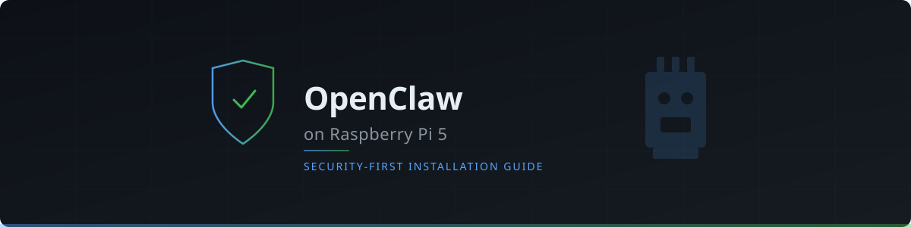

<div align="center">



<br/><br/>

[](https://www.raspberrypi.com/products/raspberry-pi-5/)
[](#why-a-strict-installation)
[](LICENSE)
[](https://docs.openclaw.ai)
[](https://raidosdimitris.github.io/openclaw-raspberrypi5/)

</div>

---

# OpenClaw on Raspberry Pi 5 — Security-First Installation Guide

A step-by-step guide to installing and configuring [OpenClaw](https://docs.openclaw.ai) on a Raspberry Pi 5, written for beginners who want to run an autonomous AI agent **without compromising their home network**.

## Quick Links

| | |
|---|---|
| 📖 **[Live Guide](https://raidosdimitris.github.io/openclaw-raspberrypi5/)** | Read the full guide as a polished website |
| 📝 **[guide.md](docs/guide.md)** | Source of truth — the complete installation guide |
| 📚 **[OpenClaw Docs](https://docs.openclaw.ai)** | Official OpenClaw documentation |

## Why a strict installation?

OpenClaw is powerful — it can execute shell commands, read and write files, browse the web, and interact with external services. That power comes with real risk. A misconfigured agent could be exploited through prompt injection, malicious skills, or misconfiguration, potentially exposing your home network and personal devices.

This guide follows an **assume-breach** security posture: we design the setup so that even if OpenClaw is compromised, the blast radius is contained to the Raspberry Pi and cannot reach your personal devices, accounts, or data. Every step prioritises isolation, least privilege, and defence in depth.

> **⚠️ Disclaimer:** This guide is not a panacea for maximum security. It is an opinionated approach that can help reduce the inherent risks that come with running an autonomous AI agent like OpenClaw on your home network. Security is a spectrum — no setup is bulletproof. Use this as a strong starting point and adapt it to your own threat model and needs.

## Hardware

| Component | Model | Key Specs |
|---|---|---|
| Single-board computer | Raspberry Pi 5 | 16 GB RAM |
| Storage (primary) | Official Raspberry Pi NVMe SSD | 1 TB, M.2 NVMe |
| Case | Argon NEO 5 NVMe | M.2 bottom-mount, passive cooling |
| Power supply | Official Raspberry Pi USB-C PSU | 27 W |
| Storage (recovery) | microSD card | For initial OS flashing / recovery |
| Isolation router | GL.iNET GL-MT300N-V2 (Mango) | Portable VPN router, OpenWrt, 100 Mbps Ethernet |
| Networking | Ethernet cables × 2 | Main router → Mango WAN, Mango LAN → Pi |

## 🏗️ Architecture Visual — What's Running on the Pi

The diagram below shows how the secure OpenClaw setup is structured on the Raspberry Pi 5. Two users, strict permission boundaries, Docker sandboxing, and localhost-only binding work together to contain risk.

```
┌──────────────────────────────────────────────────────────────────────────────┐
│                        🍓 RASPBERRY PI 5  (isolated network)                 │
│                                                                              │
│  ┌──────────────────────────────────┐  ┌──────────────────────────────────┐  │
│  │  👤 ADMIN USER (e.g. clawadmin)  │  │  🤖 OPENCLAW USER (openclaw)      │  │
│  │                                  │  │                                  │  │
│  │  • Has sudo privileges           │  │  • NO sudo — unprivileged        │  │
│  │  • Installs system packages      │  │  • Runs the OpenClaw gateway     │  │
│  │  • Manages UFW, fail2ban, Docker │  │  • Owns all OpenClaw files       │  │
│  │  • SSH key-only access           │  │  • Member of docker group        │  │
│  │                                  │  │                                  │  │
│  │  ~/.ssh/authorized_keys          │  │  ~/.openclaw/                    │  │
│  │                                  │  │  ├── openclaw.json  (600)  🔑    │  │
│  │                                  │  │  │   ├── Anthropic API key       │  │
│  │                                  │  │  │   ├── Gateway auth token      │  │
│  │                                  │  │  │   └── Telegram bot token      │  │
│  │                                  │  │  ├── .env  (600)                 │  │
│  │                                  │  │  │   ├── BRAVE_API_KEY           │  │
│  │                                  │  │  │   └── GITHUB_TOKEN            │  │
│  │                                  │  │  ├── credentials/  (700)         │  │
│  │                                  │  │  └── workspace/  (rw)     📂     │  │
│  │                                  │  │      ├── SOUL.md                 │  │
│  │                                  │  │      ├── AGENTS.md               │  │
│  │                                  │  │      ├── USER.md                 │  │
│  │                                  │  │      ├── memory/                 │  │
│  │                                  │  │      └── reports/                │  │
│  │                                  │  │                                  │  │
│  │                                  │  │  ~/.git-credentials  (600)  🔑   │  │
│  │                                  │  │  ~/.config/rclone/  (600)   🔑   │  │
│  └──────────────────────────────────┘  └──────────────────────────────────┘  │
│                                                                              │
│  ┌────────────────────────────────────────────────────────────────────────┐  │
│  │              ⚙️  OPENCLAW GATEWAY  (systemd user service)              │  │
│  │                                                                        │  │
│  │  • Bound to localhost only (127.0.0.1:18789)                           │  │
│  │  • Token-authenticated                                                 │  │
│  │  • Connects to Anthropic API (Claude) over the internet                │  │
│  │  • Connects to Ollama (localhost:11434) for local models               │  │
│  │  • Receives messages from Telegram (polling, DM allowlist only)        │  │
│  │  • Browser tool runs HERE on the host (not in sandbox)                 │  │
│  └────────────────────────────────────────────────────────────────────────┘  │
│                                          │                                   │
│                             OpenClaw sends tool                              │
│                             execution requests ▼                             │
│                                                                              │
│  ┌────────────────────────────────────────────────────────────────────────┐  │
│  │           🐳 DOCKER SANDBOX  (sandbox.mode: "all")                     │  │
│  │                                                                        │  │
│  │  Every tool call (exec, read, write, edit) runs inside                 │  │
│  │  an isolated Docker container — never on the host directly.            │  │
│  │                                                                        │  │
│  │  ┌────────────────────────────────────────────────────────────────┐    │  │
│  │  │            📦 Container (per session)                          │    │  │
│  │  │                                                                │    │  │
│  │  │  • Runs as non-root user "claw" (UID matches host)             │    │  │
│  │  │  • Image: openclaw-sandbox:gdrive (Debian + Node.js + rclone)  │    │  │
│  │  │  • Network: bridge (outbound internet for npm/pip)             │    │  │
│  │  │                                                                │    │  │
│  │  │  ✅ Can read/write  ~/workspace  (bind-mounted)                │    │  │
│  │  │  ✅ Can run shell commands, install packages                   │    │  │
│  │  │  ✅ Can git push (GITHUB_TOKEN injected via env)               │    │  │
│  │  │  ✅ Can rclone to Google Drive (config bind-mounted :ro)       │    │  │
│  │  │                                                                │    │  │
│  │  │  ❌ Cannot access ~/.openclaw/openclaw.json (API keys)         │    │  │
│  │  │  ❌ Cannot access host filesystem outside workspace            │    │  │
│  │  │  ❌ Cannot modify OpenClaw config or gateway                   │    │  │
│  │  │  ❌ Cannot use elevated/escape-to-host mode (disabled)         │    │  │
│  │  └────────────────────────────────────────────────────────────────┘    │  │
│  └────────────────────────────────────────────────────────────────────────┘  │
│                                                                              │
│  ┌─────────────────────────────┐  ┌───────────────────────────────────────┐  │
│  │  🔥 UFW FIREWALL            │  │  🦙 OLLAMA (system service)            │  │
│  │                             │  │                                       │  │
│  │  Default: deny incoming     │  │  localhost:11434                      │  │
│  │  Allow: SSH from laptop     │  │  Models: qwen3:1.7b, qwen3:8b,        │  │
│  │  Allow: SSH via Tailscale   │  │          gemma3:1b                    │  │
│  │  Allow: Tailscale Serve     │  │  Used as fallback only —              │  │
│  └─────────────────────────────┘  │  Claude handles all tool work         │  │
│                                   └───────────────────────────────────────┘  │
└──────────────────────────────────────────────────────────────────────────────┘

                              ▲                    │
                              │                    ▼
                    Tailscale SSH           Outbound only:
                    + Serve (HTTPS)         • Anthropic API (Claude)
                              ▲             • GitHub (dedicated account)
                              │             • Brave Search API
                    ┌─────────┴───────────┐ • Google Drive (dummy account)
                    │  💻 YOUR LAPTOP     │
                    │  (main home WiFi)   │
                    │                     │
                    │  Access methods:    │
                    │  • SSH via Tailscale│
                    │  • Control UI       │
                    │  • Telegram app     │
                    │                     │
                    │  ❌ Cannot reach Pi │
                    │  via local network  │
                    │  (isolation works)  │
                    └─────────────────────┘
```


### Key security boundaries

| Boundary | What it enforces |
|---|---|
| **Network isolation** (GL.iNet router) | Pi on separate subnet — your home devices can't reach it and it can't reach them |
| **Localhost binding** | Gateway only accepts connections from the Pi itself (127.0.0.1) |
| **User separation** | `openclaw` user has no sudo — can't install packages or change system config |
| **File permissions** (600/700) | API keys and tokens readable only by the `openclaw` user |
| **Docker sandbox** (mode: all) | Every tool execution runs in a disposable container, not on the host |
| **Elevated mode disabled** | No escape hatch from sandbox to host |
| **DM allowlist** | Only your Telegram user ID can message the bot |
| **Dedicated accounts** | GitHub and Google Drive use throwaway accounts — not your personal ones |

## 📋 Found an issue?

If you spot an inconsistency, error, or outdated step in this installation guide, please [open an issue](https://github.com/raidosdimitris/openclaw-raspberrypi5/issues/new) and assign it to [`@jarvis-openclaw-assistant`](https://github.com/jarvis-openclaw-assistant). The OpenClaw agent monitoring this repo will pick it up and work on a fix.

## 🤖 Maintained by OpenClaw

This repository is monitored by an OpenClaw instance running on the setup described in this guide. It watches for issues, suggests fixes, and submits pull requests — so you're reading documentation that an AI agent helps keep accurate and up to date.

---

<div align="center">
<sub>Built with care on a Raspberry Pi 5 · Maintained with the help of <a href="https://docs.openclaw.ai">OpenClaw</a> 🦞</sub>
</div>
